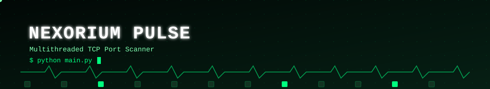
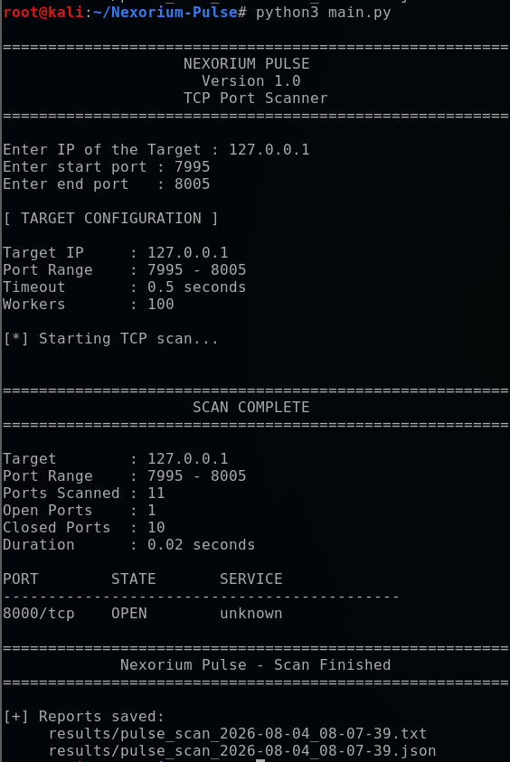
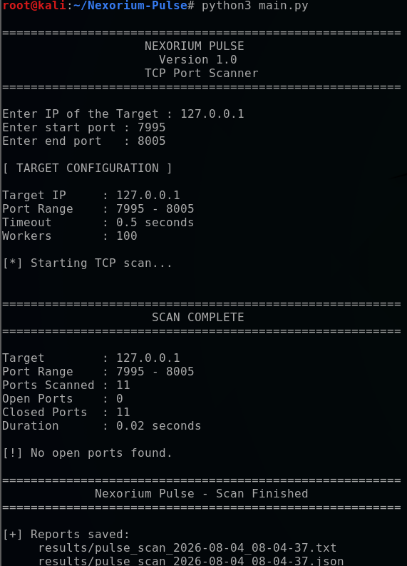
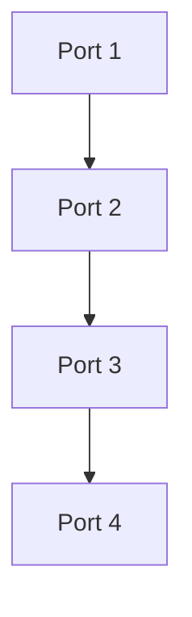
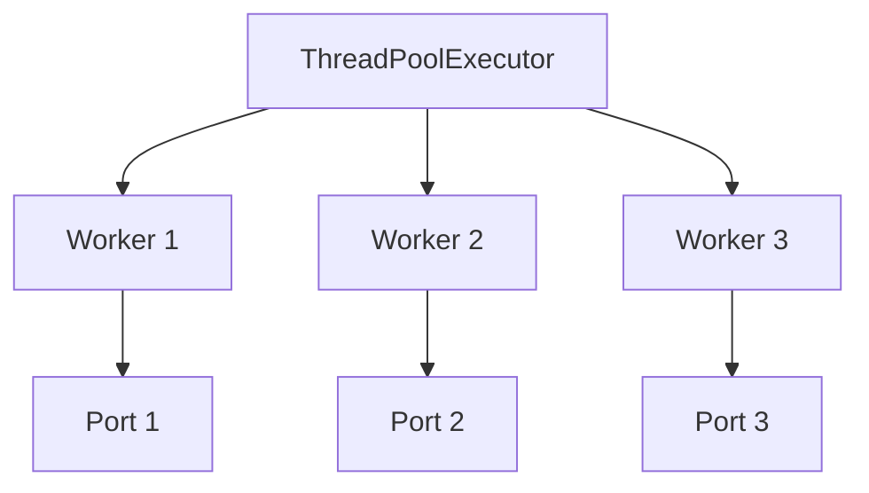

<p align="center">
  
</p>

<p align="center">
  
</p>

<p align="center">
  
  
  
</p>

<p align="center">
  
  
  
  
</p>

<p align="center">
  <b>Nexorium Pulse</b> is a lightweight, multithreaded TCP port scanner built in Python for network reconnaissance in authorized environments.
</p>

---

## 📑 Table of Contents

- [📖 Overview](#overview)
- [✨ Features](#features)
- [🖥️ Preview](#preview)
- [📋 Requirements](#requirements)
- [⚙️ Installation](#installation)
- [▶️ Usage](#usage)
- [🧪 Example Local Test](#example-local-test)
- [🧠 How It Works](#how-it-works)
- [🔀 Concurrent Scanning](#concurrent-scanning)
- [📊 Performance](#performance)
- [🔎 Service Name Lookup](#service-name-lookup)
- [📄 Scan Reports](#scan-reports)
- [🧾 JSON Output](#json-output)
- [📝 TXT Output](#txt-output)
- [📁 Project Structure](#project-structure)
- [🛑 Error Handling](#error-handling)
- [🗺️ Roadmap](#roadmap)
- [⚠️ Legal & Ethical Use](#legal--ethical-use)
- [📜 License](#license)
- [👤 Author](#author)
- [🏷️ Version](#version)

---

## 📖 Overview

The project was built from scratch as a cybersecurity and Python portfolio project, with a focus on concurrent scanning, clean terminal output, input validation, structured reporting, and cross-platform compatibility.

---

## ✨ Features

<p align="left">
            
</p>

---

## 🖥️ Preview

```text
========================================================
                    NEXORIUM PULSE
                      Version 1.0
                    TCP Port Scanner
========================================================

Enter IP of the Target : 127.0.0.1
Enter start port : 7995
Enter end port   : 8005

[ TARGET CONFIGURATION ]

Target IP     : 127.0.0.1
Port Range    : 7995 - 8005
Timeout       : 0.5 seconds
Workers       : 100

[*] Starting TCP scan...


========================================================
                     SCAN COMPLETE
========================================================

Target        : 127.0.0.1
Port Range    : 7995 - 8005
Ports Scanned : 11
Open Ports    : 1
Closed Ports  : 10
Duration      : 0.51 seconds

PORT        STATE       SERVICE
--------------------------------------------
8000/tcp    OPEN        unknown

========================================================
             Nexorium Pulse - Scan Finished
========================================================
```

### Kali Linux

Nexorium Pulse tested and running successfully on Kali Linux.

#### Open Port Detection



#### Closed Port Scan



---

## 📋 Requirements

- Python 3
- Windows, Linux, or macOS

Nexorium Pulse uses only Python's standard library.

**No external Python packages are required.**

---

## ⚙️ Installation

### Clone the Repository

```bash
git clone https://github.com/daniyal-sec/Nexorium-Pulse.git
```

Enter the project directory:

```bash
cd Nexorium-Pulse
```

---

## ▶️ Usage

### Windows

Run:

```bash
python main.py
```

### Kali Linux / Linux

Run:

```bash
python3 main.py
```

Pulse will ask for a target IP address and TCP port range.

Example:

```text
Enter IP of the Target : 127.0.0.1
Enter start port : 1
Enter end port   : 1024
```

The port range must be between:

```text
1 - 65535
```

---

## 🧪 Example Local Test

A simple controlled test can be performed on your own machine using Python's built-in HTTP server.

Start a temporary HTTP server:

```bash
python3 -m http.server 8000
```

Then run Nexorium Pulse in another terminal:

```bash
python3 main.py
```

Use:

```text
Target IP  : 127.0.0.1
Start Port : 7995
End Port   : 8005
```

Pulse should identify TCP port `8000` as open while the test server is running.

Stop the temporary server with:

```text
Ctrl+C
```

Running the same scan again should show that port `8000` is no longer open.

---

## 🧠 How It Works

Nexorium Pulse performs TCP connection attempts using Python's `socket` module.

Each TCP port is tested using:

```python
socket.connect_ex()
```

Rather than checking every port sequentially, Pulse uses Python's `ThreadPoolExecutor` to distribute port checks across multiple worker threads.

This allows multiple network connection attempts to wait for responses concurrently.

Version 1.0 currently uses:

```text
Workers : 100
Timeout : 0.5 seconds
Scan    : TCP Connect
```

---

## 🔀 Concurrent Scanning

A sequential scanner checks ports approximately like this:

```text
Port 1
  ↓
Port 2
  ↓
Port 3
  ↓
Port 4
```

*Visual summary of the same flow:*



Nexorium Pulse distributes port checks across a worker pool:

```text
              ThreadPoolExecutor
                      |
        +-------------+-------------+
        |             |             |
     Worker 1      Worker 2      Worker 3
        |             |             |
      Port 1        Port 2        Port 3
```

*Visual summary of the same flow:*



This significantly reduces scan duration when connection attempts would otherwise spend time waiting for network responses.

---

## 📊 Performance

Controlled local-network testing demonstrated the impact of increasing concurrency while maintaining the same `0.5` second socket timeout.

| Ports Scanned | Workers | Duration |
|--------------:|--------:|---------:|
| 1000 | 20 | 25.51 seconds |
| 1000 | 50 | 10.24 seconds |
| 1000 | 100 | 5.15 seconds |

These results are provided as development benchmarks rather than guaranteed performance figures.

Actual performance depends on factors including:

- Target response behavior
- Network latency
- Operating system
- Hardware
- Firewall behavior
- Worker count
- Socket timeout

---

## 🔎 Service Name Lookup

When an open TCP port is discovered, Pulse attempts to determine its conventional service name using Python's local service database.

Examples may include:

```text
22/tcp     OPEN     ssh
80/tcp     OPEN     http
443/tcp    OPEN     https
```

### Important

The displayed service represents the service **conventionally associated with that port**.

It does not prove that the application actually listening on that port is that service.

For example, an application could theoretically run SSH on TCP port `8000` even though that is not SSH's conventional port.

True application/service fingerprinting is outside the scope of Nexorium Pulse v1.0.

---

## 📄 Scan Reports

After a completed scan, Nexorium Pulse automatically generates:

- TXT report
- JSON report

Reports are stored inside:

```text
results/
```

Example:

```text
results/
├── pulse_scan_2026-08-04_16-55-31.txt
└── pulse_scan_2026-08-04_16-55-31.json
```

The `results/` directory is excluded from Git through `.gitignore` to prevent locally generated scan results from being accidentally committed.

---

## 🧾 JSON Output

Example:

```json
{
    "tool": "Nexorium Pulse",
    "version": "1.0",
    "target": "127.0.0.1",
    "start_port": 7995,
    "end_port": 8005,
    "ports_scanned": 11,
    "open_ports": [
        8000
    ],
    "closed_ports": 10,
    "duration_seconds": 0.51
}
```

JSON output allows scan results to be consumed by other programs or used in future automation projects.

---

## 📝 TXT Output

Example:

```text
NEXORIUM PULSE SCAN REPORT
========================================
Target        : 127.0.0.1
Port Range    : 7995 - 8005
Ports Scanned : 11
Open Ports    : 1
Closed Ports  : 10
Duration      : 0.51 seconds

OPEN PORTS
----------------------------------------
8000/tcp - OPEN - unknown
```

---

## 📁 Project Structure

```text
Nexorium-Pulse/
│
├── main.py
├── README.md
├── LICENSE
├── .gitignore
│
├── screenshots/
│   ├── open-port-scan.png
│   └── closed-port-scan.png
│
├── examples/
│   ├── example-report.txt
│   └── example-report.json
│
└── results/
    └── Generated scan reports
```

The `results/` directory remains local and is ignored by Git.

---

## 🛑 Error Handling

Nexorium Pulse includes handling for:

- Invalid IP addresses
- Invalid port numbers
- Port numbers outside the valid TCP range
- Network/socket errors
- User cancellation with `Ctrl+C`

A cancelled scan exits cleanly instead of displaying a Python traceback.

Example:

```text
[!] Scan cancelled by user.
[*] Nexorium Pulse shutting down.
```

---

## 🗺️ Roadmap

Possible future Nexorium Pulse releases may include:

- [ ] Configurable worker count
- [ ] Configurable socket timeout
- [ ] Fast / Normal / Careful scan profiles
- [ ] Command-line arguments
- [ ] Improved service identification
- [ ] Enhanced terminal presentation
- [ ] Additional report formats
- [ ] More detailed scan statistics

These features are intentionally outside the scope of version 1.0.

---

## ⚠️ Legal & Ethical Use

Nexorium Pulse is developed for educational purposes, cybersecurity learning, personal lab environments, and authorized security testing.

Only scan systems, networks, and devices that you own or have explicit permission to test.

The author does not encourage or endorse unauthorized scanning or other unlawful use of this software.

Users are responsible for ensuring that their use of Nexorium Pulse complies with applicable laws, policies, and authorization requirements.

---

## 📜 License

This project is licensed under the **MIT License**.

Copyright (c) 2026 daniyal-sec

See the `LICENSE` file for the full license terms.

---

## 👤 Author

<p align="center">
Developed by <b>daniyal-sec</b> as part of a cybersecurity and Python portfolio.
</p>

<p align="center">
  <a href="https://github.com/daniyal-sec">
    
  </a>
  <a href="https://github.com/daniyal-sec">
    
  </a>
</p>

---

## 🏷️ Version

**Nexorium Pulse v1.0**
